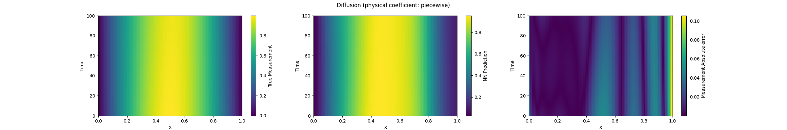
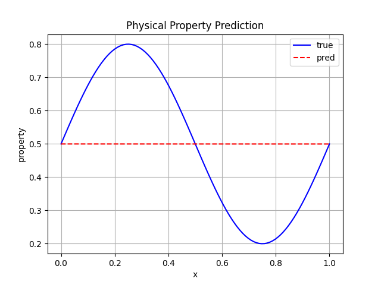

# Diffusion Equation PINN Experiment

This experiment trains a Physics-Informed Neural Network (PINN) for a 1D diffusion inverse problem:

- recover the field `u(x, t)`
- recover the spatial coefficient `alpha(x)`

In this baseline setup, the model typically fits `u(x, t)` well, while `alpha(x)` can collapse to an almost constant line (identifiability issue).

## Current Structure

```text
diffusion_equation/
├── README.md
├── train.py
├── model.py
├── dataset/
│   ├── diffusion_equations.py
│   ├── mesh_grid.py
│   └── utils.py
├── loss_function/
│   ├── diffusion_loss.py
│   └── loss_function.py
├── plots/
│   ├── figures.py
│   └── loss_function.py
└── figures/
    ├── sample_prediction.png
    └── physical_property_prediction.png
```

## Run

From the repository root:

```bash
python3 diffusion_equation/train.py
```

The script trains the PINN, displays the loss curve, and writes output figures into `diffusion_equation/figures/`.

## Results

### Field Prediction `u(x, t)`



### Physical Coefficient `alpha(x)`



## Notes

- `u_net` learns from direct field supervision and can explain most behavior alone.
- `alpha_net` is coupled mainly through PDE and regularization terms, so recovery is sensitive to loss weights, data diversity, and constraints.
