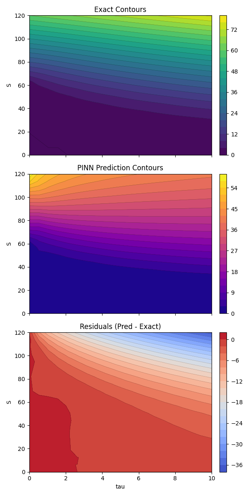
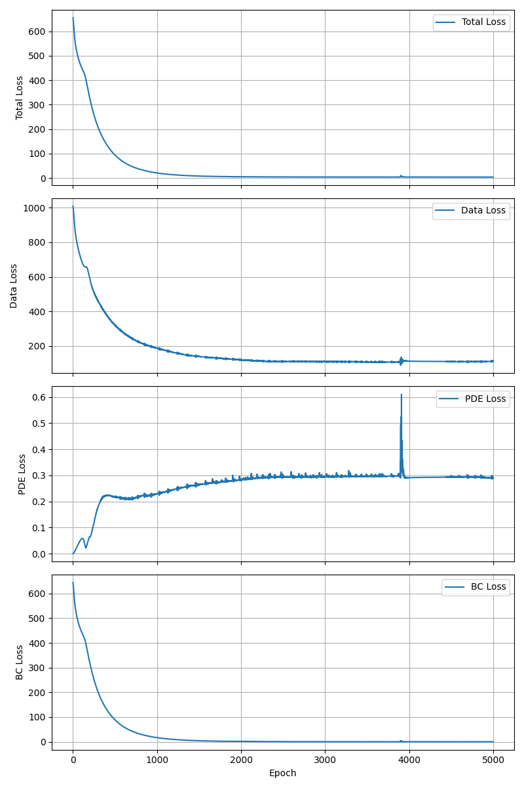

# Options: Black-Scholes Equation

Options price is generally modeled using the Black-Scholes PDE. This experiment solves it with a PINN
using time-to-maturity `tau` and compares the prediction against the analytical solution.

**Black–Scholes Equation**
For a European call with no dividends, the pricing PDE in calendar time `t` is:
$$
V_t + \tfrac{1}{2}\sigma^2 S^2 V_{SS} + r S V_S - r V = 0
$$
Using time-to-maturity $$\tau = T - t$$ 
the PDE becomes:
$$
- V_{\tau} + \tfrac{1}{2}\sigma^2 S^2 V_{SS} + r S V_S - r V = 0
$$
Boundary/terminal conditions include the payoff at maturity `V(S, tau=0) = max(S - K, 0)` and
behavior at `S=0` (option value near zero).

**Inverse Problem Setup**
The inverse problem is to infer model parameters (e.g., `sigma`, possibly `r`) from observed option
prices. A PINN can be trained by combining:
- a data loss between predicted and observed prices,
- a PDE residual loss that enforces Black–Scholes dynamics,
- boundary/terminal condition losses.
This turns parameter estimation into a physics-informed regression task. In this repo we still use
analytical prices as supervision targets, but the same structure applies when those targets come from
market data.

**What the script does**
- Builds a PINN `V(S, tau)` and trains on data loss + PDE residual + boundary conditions.
- Uses the analytical Black-Scholes formula to generate supervision targets.
- Logs loss curves and saves contour plots for exact vs. predicted surfaces and residuals.

**Figures**
- Contours (exact, prediction, residuals): `experiments/options/figures/option_price_contours.png`
- Loss curves (total, data, PDE, BC): `experiments/options/figures/loss_curves.png`

The contour figure compares the analytical solution to the PINN prediction across `S` and `tau`. The
residuals plot highlights where the PINN over/under-estimates the true price surface. The loss curves
show how the data, PDE, and boundary terms evolve through training.





**Run**
```bash
python experiments/options/train.py
```
