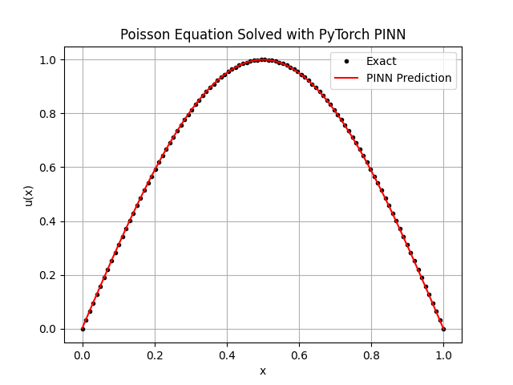
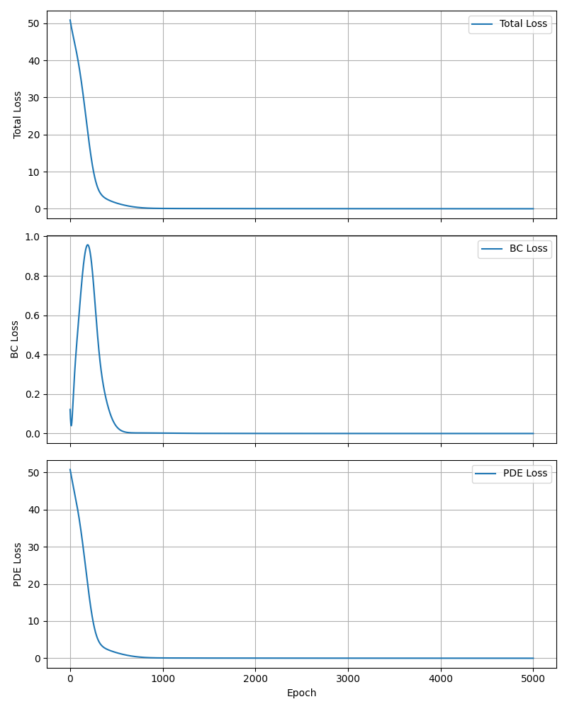

# Toy Problem (1D Poisson PINN)

Small, self-contained PINN demo solving a 1D Poisson equation on $x \in [0,1]$.
This setup is an inverse discrete PINN problem: the network is trained against discretized residuals at collocation points and boundary values, and the solution is inferred from these constraints.

- PDE: $u_{xx} + \pi^2 \sin(\pi x) = 0$ (i.e., $u_{xx} = -\pi^2 \sin(\pi x)$)
- Boundary conditions: $u(0)=u(1)=0$
- Exact solution used for comparison: $u(x)=\sin(\pi x)$

The model is a simple MLP (3 layers, 50 hidden units, `tanh`) trained with Adam.
The loss is the sum of the PDE residual MSE and boundary MSE.

## Run

```bash
python experiments/toy_problem/train.py
```

This generates the figure at:

```
experiments/toy_problem/figures/pinn_poisson.png
```

## Result



The figure compares the exact solution (solid) with the PINN prediction (dashed) over the domain. The curves should overlap closely, indicating the network satisfies both the PDE residual and boundary constraints.



The loss figure shows the total loss, boundary-condition loss, and PDE-residual loss across training epochs, each in its own subplot. It helps verify stable convergence and the relative contribution of each term during training.