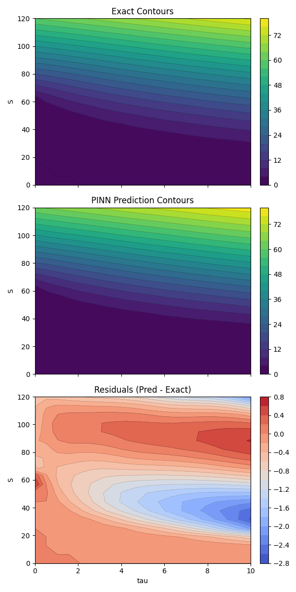
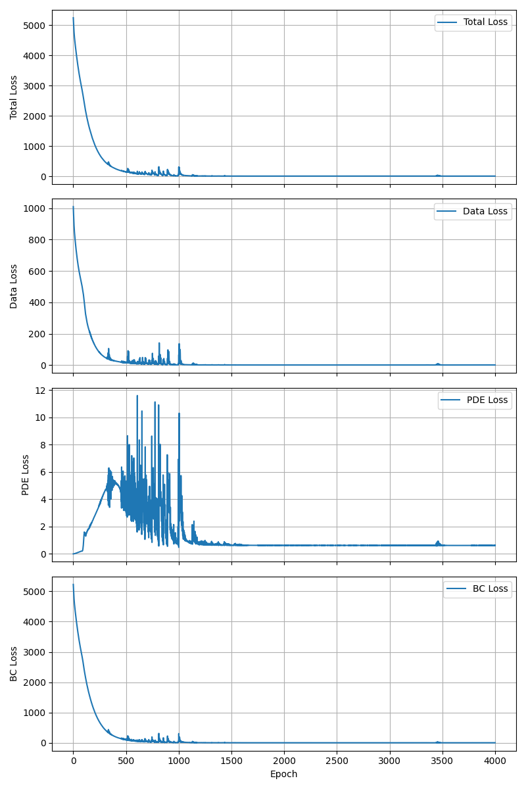

# Options: Black-Scholes Equation

Options price is generally modeled using the Black-Scholes PDE. This experiment solves it with a PINN
using time-to-maturity `tau` and compares the prediction against the analytical solution.

## Black–Scholes Equation
For a European call with no dividends, the pricing PDE $V$ in calendar time `t` is:
$$
V_t + \tfrac{1}{2}\sigma^2 S^2 V_{SS} + r S V_S - r V = 0
$$
where $V(S,t)$ is the option price as a function of the stock price $S$ and calendar time `t`, $r$ is he constant risk-free rate and $\sigma$ is the volatility constant. 

Using the standard time-to-maturity definition $\tau = T - t$, the PDE becomes:
$$
- V_{\tau} + \tfrac{1}{2}\sigma^2 S^2 V_{SS} + r S V_S - r V = 0
$$
Boundary/terminal conditions are:
* the payoff at maturity: $V(S, \tau=0) = \max(S - K, 0)$
* the behavior at stock price zero (option value near zero): $V(s=0,t) = 0$
* the large-stock boundary at the truncation limit: $V(S_{\max}, \tau) \approx S_{\max} - K e^{-r\tau}$

## Inverse Problem Setup
The inverse problem is to infer model parameters (e.g., `sigma`, possibly `r`) from observed option
prices. A PINN can be trained by combining:
- a data loss between predicted and observed prices,
- a PDE residual loss that enforces Black–Scholes dynamics,
- boundary/terminal condition losses.
This turns parameter estimation into a physics-informed regression task. In this repo we still use
analytical prices as supervision targets, but the same structure applies when those targets come from
market data.

## What the script does

```bash
python options/train.py
```

- Builds a PINN `V(S, tau)` and trains on data loss + PDE residual + boundary conditions.
- Uses the analytical Black-Scholes formula to generate supervision targets.
- Logs loss curves and saves contour plots for exact vs. predicted surfaces and residuals.

## Figures
- Contours (exact, prediction, residuals): `options/figures/option_price_contours.png`
- Loss curves (total, data, PDE, BC): `options/figures/loss_curves.png`

The contour figure compares the analytical solution to the PINN prediction across `S` and `tau`. The
residuals plot highlights where the PINN over/under-estimates the true price surface. The loss curves
show how the data, PDE, and boundary terms evolve through training.




We observed a moment where PDE loss term increases but hopefully it turns down again and all 4 loss terms decrease to a clear plateau near zero.


